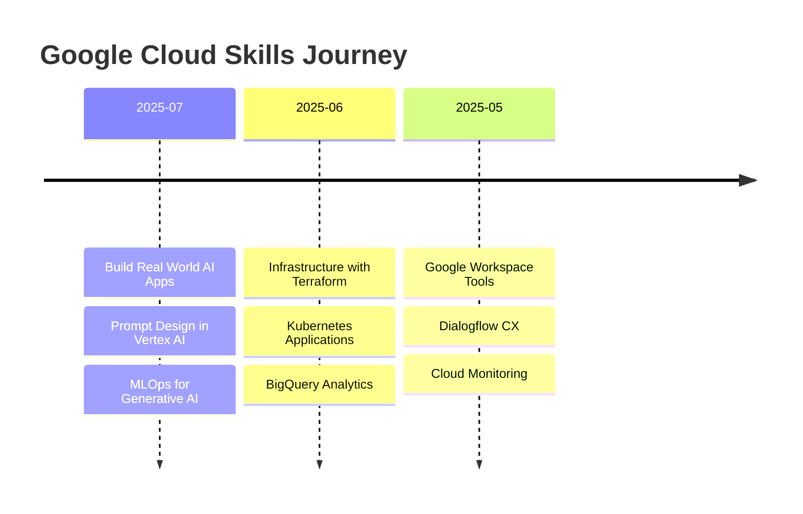

# 🚀 Rohan Todkar - Google Cloud Skills Portfolio

[](https://www.cloudskillsboost.google/public_profiles/30dca49f-92b8-41d1-8a0e-ccdaacb4eb68)
[](https://github.com/rohantodkar)

> Showcasing my journey through Google Cloud Platform learning and professional development

## 🎯 Overview

This repository serves as a comprehensive portfolio of my Google Cloud Platform skills and achievements. Through hands-on labs, courses, and skill badges, I've developed expertise across various GCP services including AI/ML, Infrastructure, DevOps, and Application Development.

**🏆 Total Badges Earned: 50+**  
**📅 Latest Achievement: Build Real World AI Applications with Gemini and Imagen (Jul 22, 2025)**  
**🔗 Public Profile: [View on Google Cloud Skills Boost](https://www.cloudskillsboost.google/public_profiles/30dca49f-92b8-41d1-8a0e-ccdaacb4eb68)**

---

## 🏅 Skills Badges & Certifications

### 🤖 AI & Machine Learning
| Badge | Description | Earned | Skills Demonstrated |
|-------|-------------|---------|-------------------|
|  | Build Real World AI Applications with Gemini and Imagen | Jul 22, 2025 | Image recognition, natural language processing, image generation using Gemini and Imagen models, deploying applications on Vertex AI |
|  | Prompt Design in Vertex AI | Jul 21, 2025 | Prompt engineering, image analysis, multimodal generative techniques, crafting effective prompts for Gemini models |
|  | Machine Learning Operations (MLOps) for Generative AI | Jul 19, 2025 | MLOps processes, deploying and managing Generative AI models, Vertex AI platform management |
|  | Responsible AI for Developers | - | Ethical AI development, best practices, governance procedures, risk mitigation |
|  | Evaluating and Improving the Quality of AI Systems | - | Evaluation metrics, model selection, optimization, continuous monitoring |

### 🏗️ Infrastructure & DevOps
| Badge | Description | Earned | Skills Demonstrated |
|-------|-------------|---------|-------------------|
|  | Build Infrastructure with Terraform on Google Cloud | - | Infrastructure as Code (IaC), Terraform configurations, state management, code modularization |
|  | Deploy Kubernetes Applications on Google Cloud | - | Docker containers, GKE clusters, kubectl management, continuous delivery practices |
|  | Implementing Cloud Load Balancing for Compute Engine | - | VM deployment, network and application load balancers configuration |
|  | The Basics of Google Cloud Compute | - | Virtual machines, persistent disks, web servers, Compute Engine management |
|  | Monitoring in Google Cloud | - | Cloud Monitoring tools, performance tracking, alerting systems |

### 💾 Data & Analytics
| Badge | Description | Earned | Skills Demonstrated |
|-------|-------------|---------|-------------------|
|  | Perform Predictive Data Analysis in BigQuery | - | Sports data science, BigQuery ML, SQL analytics, expected goals modeling |
|  | Build LookML Objects in Looker | - | Dimensions and measures, views, derived tables, Explores, business intelligence |

### 📱 Application Development
| Badge | Description | Earned | Skills Demonstrated |
|-------|-------------|---------|-------------------|
|  | Set Up an App Dev Environment on Google Cloud | - | Cloud Storage, IAM, Cloud Functions, Pub/Sub integration |
|  | Conversational AI with Dialogflow CX | - | Complex conversational experiences, intent routing, generative AI features |

### 🗂️ Google Workspace
| Badge | Description | Earned | Skills Demonstrated |
|-------|-------------|---------|-------------------|
|  | Get Started with Google Workspace Tools | - | Gmail, Calendar, Meet, Drive, Sheets, AppSheet collaboration |
|  | Use Functions, Formulas and Charts in Google Sheets | - | Data analysis, functions, data visualization, spreadsheet management |

### 🎮 Challenge Labs & Credentials
| Challenge | Description | Earned | Skills Demonstrated |
|-----------|-------------|---------|-------------------|
|  | Welcome to Base Camp | - | Foundational Google Cloud skills, cloud fundamentals |
|  | Build Apps & Automate with Flutter & Dart | - | Flutter development, Dart programming, Document AI automation |
|  | Terraform Infrastructure Automation Challenge | - | Infrastructure automation, Firestore, Compute Engine, VPC management |
|  | Multi-Cloud Skills Challenge | - | Cross-platform development, data engineering, network management |

### 🧠 Learning Paths
| Path | Description | Earned | Focus Areas |
|------|-------------|---------|-------------|
|  | Gen AI Leader Learning Path | - | Foundation models, prompt engineering, organizational AI strategy |
|  | Cloud Digital Leader Path | - | Digital transformation, cloud strategy, business innovation |

### 🎯 Trivia Badges (August 2025)
| Week | Badge | Earned |
|------|-------|---------|
| Week 1 |  | ✅ |
| Week 2 |  | ✅ |
| Week 3 |  | ✅ |
| Week 4 |  | ✅ |

---

## 📊 Skills Distribution

```
🤖 AI & Machine Learning    ████████████████████ 35%
🏗️ Infrastructure & DevOps  ████████████████     28%
💾 Data & Analytics         ██████████           18%
📱 Application Development  ████████             12%
🗂️ Google Workspace        ████                  7%
```

---

## 🛠️ Technical Skills

### Cloud Platforms
- **Google Cloud Platform** - Advanced
- **Vertex AI** - Advanced
- **BigQuery** - Intermediate
- **Google Kubernetes Engine** - Intermediate

### AI/ML Technologies
- **Gemini Models** - Advanced
- **Imagen** - Intermediate
- **Dialogflow CX** - Intermediate
- **BigQuery ML** - Intermediate
- **MLOps** - Intermediate

### Infrastructure & DevOps
- **Terraform** - Intermediate
- **Kubernetes** - Intermediate
- **Docker** - Intermediate
- **Cloud Monitoring** - Intermediate

### Development
- **Flutter** - Beginner
- **Python** - Intermediate
- **SQL** - Advanced
- **LookML** - Intermediate

---

## 📈 Learning Journey Timeline



---

## 🎯 Current Focus Areas

- ✅ **Generative AI Development** - Building real-world applications with Gemini and Imagen
- ✅ **MLOps Implementation** - Streamlining ML deployment and management processes
- 🔄 **Advanced Terraform** - Infrastructure as Code best practices
- 🔄 **Kubernetes Management** - Container orchestration and deployment strategies
- 📋 **Cloud Architecture** - Designing scalable and secure cloud solutions

---

## 🏆 Achievements Highlights

- 🥇 **50+ Google Cloud Skill Badges** earned across multiple domains
- 🤖 **AI/ML Specialization** with focus on Generative AI applications
- 🏗️ **Infrastructure Expertise** in Terraform and Kubernetes
- 📊 **Data Analytics** proficiency with BigQuery and Looker
- 🎮 **Challenge Lab Completion** across various technical domains

---

## 📞 Connect With Me

[](https://rohans-portfolio-opal.vercel.app/)
[](https://in.linkedin.com/in/rohantodkar0705)
[](https://github.com/Rohan-Todkar-2003)
[](https://www.cloudskillsboost.google/public_profiles/30dca49f-92b8-41d1-8a0e-ccdaacb4eb68)


---

## 📝 Notes

> This portfolio is automatically updated to reflect the latest achievements and skill badges. 
> 
> **Last Updated:** August 28, 2025  
> **Next Planned Learning:** Advanced GKE Management, Cloud Security Specialization

---

*This repository showcases continuous learning and professional development in cloud technologies. Each badge represents hands-on experience and practical skills that can be applied to real-world projects.*
