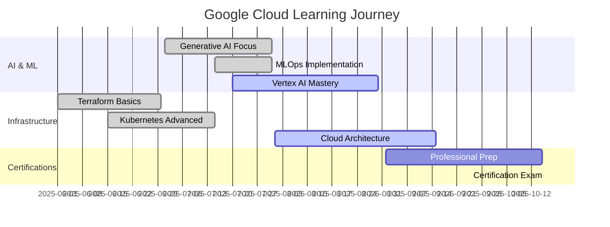

# 🚀 Rohan Todkar - Google Cloud Skills Portfolio

<div align="center">


[](https://www.cloudskillsboost.google/public_profiles/30dca49f-92b8-41d1-8a0e-ccdaacb4eb68)
[](https://github.com/Rohan-Todkar-2003)
[](https://github.com/Rohan-Todkar-2003/gcp-skills-portfolio)


</div>

---

## 🎯 Professional Summary

<table>
<tr>
<td width="50%" valign="top">

### 🏆 **Achievements Overview**
- **50+ Google Cloud Badges** 🥇
- **AI/ML Specialization** 🤖
- **Infrastructure Expert** 🏗️
- **Continuous Learner** 📚

</td>
<td width="50%" valign="top">

### 📈 **Latest Milestones**
- **🔥 Recent:** Build Real World AI Applications (Jul 2025)
- **⚡ Focus:** Generative AI & MLOps
- **🎯 Next:** Advanced GKE & Cloud Security
- **🌟 Goal:** Google Cloud Professional Certification

</td>
</tr>
</table>

<div align="center">

**📊 Skills Distribution Chart**

```
🤖 AI & Machine Learning    ████████████████████ 35%
🏗️ Infrastructure & DevOps  ████████████████     28% 
💾 Data & Analytics         ██████████           18%
📱 Application Development  ████████             12%
🗂️ Google Workspace         ████                  7%
```

</div>

---

## 🏅 Interactive Skills Showcase

<details>
<summary><b>🤖 AI & Machine Learning Expertise</b> <i>(Click to expand)</i></summary>

<div align="center">

### 🧠 **Artificial Intelligence & Machine Learning**

<table>
<tr>
<td align="center" width="200">

<br><b>Build Real World AI Apps</b><br>
<code>Gemini & Imagen</code><br>

</td>
<td align="center" width="200">

<br><b>Prompt Design</b><br>
<code>Vertex AI</code><br>

</td>
<td align="center" width="200">

<br><b>MLOps for Gen AI</b><br>
<code>Vertex AI Platform</code><br>

</td>
</tr>
<tr>
<td align="center" width="200">

<br><b>Responsible AI</b><br>
<code>Development</code><br>

</td>
<td align="center" width="200">

<br><b>AI Model Evaluation</b><br>
<code>Quality Systems</code><br>

</td>
<td align="center" width="200">

<br><b>Gen AI Leader Path</b><br>
<code>Organizational Strategy</code><br>

</td>
</tr>
</table>

**🎯 Key Skills:** `Gemini Models` • `Imagen` • `Prompt Engineering` • `MLOps` • `Vertex AI` • `Responsible AI`

</div>
</details>

<details>
<summary><b>🏗️ Infrastructure & DevOps Mastery</b> <i>(Click to expand)</i></summary>

<div align="center">

### ⚡ **Infrastructure & DevOps**

<table>
<tr>
<td align="center" width="200">

<br><b>Terraform Infrastructure</b><br>
<code>Google Cloud</code><br>

</td>
<td align="center" width="200">

<br><b>Kubernetes Apps</b><br>
<code>GKE Deployment</code><br>

</td>
<td align="center" width="200">

<br><b>Cloud Load Balancing</b><br>
<code>Compute Engine</code><br>

</td>
</tr>
<tr>
<td align="center" width="200">

<br><b>Cloud Compute Basics</b><br>
<code>VM Management</code><br>

</td>
<td align="center" width="200">

<br><b>Cloud Monitoring</b><br>
<code>Performance Tracking</code><br>

</td>
<td align="center" width="200">

<br><b>Terraform Challenge</b><br>
<code>Automation</code><br>

</td>
</tr>
</table>

**🎯 Key Skills:** `Terraform` • `Kubernetes` • `Docker` • `GKE` • `Load Balancing` • `Infrastructure as Code`

</div>
</details>

<details>
<summary><b>💾 Data & Analytics Excellence</b> <i>(Click to expand)</i></summary>

<div align="center">

### 📊 **Data & Analytics**

<table>
<tr>
<td align="center" width="300">

<br><b>BigQuery Predictive Analysis</b><br>
<code>Sports Data Science & ML</code><br>

</td>
<td align="center" width="300">

<br><b>Looker LookML Objects</b><br>
<code>Business Intelligence</code><br>

</td>
</tr>
</table>

**🎯 Key Skills:** `BigQuery` • `SQL Analytics` • `BigQuery ML` • `Looker` • `LookML` • `Data Visualization`

</div>
</details>

<details>
<summary><b>📱 Application Development Skills</b> <i>(Click to expand)</i></summary>

<div align="center">

### 🖥️ **Application Development**

<table>
<tr>
<td align="center" width="200">

<br><b>App Dev Environment</b><br>
<code>Google Cloud</code><br>

</td>
<td align="center" width="200">

<br><b>Dialogflow CX</b><br>
<code>Conversational AI</code><br>

</td>
<td align="center" width="200">

<br><b>Flutter Development</b><br>
<code>Build Apps Challenge</code><br>

</td>
</tr>
</table>

**🎯 Key Skills:** `Cloud Functions` • `Pub/Sub` • `Dialogflow CX` • `Flutter` • `Cloud Storage` • `IAM`

</div>
</details>

<details>
<summary><b>🗂️ Google Workspace Proficiency</b> <i>(Click to expand)</i></summary>

<div align="center">

### 🏢 **Google Workspace**

<table>
<tr>
<td align="center" width="300">

<br><b>Google Workspace Tools</b><br>
<code>Collaboration Platform</code><br>

</td>
<td align="center" width="300">

<br><b>Google Sheets Advanced</b><br>
<code>Functions & Charts</code><br>

</td>
</tr>
</table>

**🎯 Key Skills:** `Gmail` • `Calendar` • `Meet` • `Drive` • `Sheets` • `AppSheet` • `Collaboration`

</div>
</details>

---

## 🎮 Challenge Labs & Gaming

<div align="center">

### 🏆 **Challenge Completions**

| 🏕️ Base Camp | 🎯 Multi-Cloud Skills | 🎮 Trivia Master | 🏗️ Build & Deploy |
|:---:|:---:|:---:|:---:|
|  |  |  |  |

### 🎯 **August 2025 Trivia Streak**
   

</div>

---

## 📈 Learning Journey & Analytics

<div align="center">

### 🚀 **Progress Timeline**



### 💪 **Skills Heatmap**

<table>
<tr>
<td width="33%" align="center">
<h4>🔥 Advanced</h4>
<br>
<br>

</td>
<td width="33%" align="center">
<h4>⚡ Intermediate</h4>
<br>
<br>

</td>
<td width="33%" align="center">
<h4>🌱 Learning</h4>
<br>
<br>

</td>
</tr>
</table>

</div>

---

## 🎯 Current Objectives & Goals

<table>
<tr>
<td width="50%" valign="top">

### 🎯 **2025 Goals**
- [ ] **Google Cloud Professional Certification**
- [ ] **Advanced Kubernetes Certification**
- [x] **50+ Skill Badges** ✅
- [ ] **Contribute to Open Source GCP Tools**
- [ ] **Speak at Cloud Conference**

</td>
<td width="50%" valign="top">

### 🔄 **Currently Learning**
- **Advanced GKE Management**
- **Cloud Security & Compliance**
- **Multi-Cloud Architecture**
- **Site Reliability Engineering**
- **Cloud Cost Optimization**

</td>
</tr>
</table>

---

## 🛠️ Technical Arsenal

<div align="center">

### 🚀 **Technology Stack**

<table>
<tr>
<td align="center" width="25%">
<h4>☁️ Cloud Platforms</h4>
<br>
<br>

</td>
<td align="center" width="25%">
<h4>🤖 AI/ML Tools</h4>
<br>
<br>

</td>
<td align="center" width="25%">
<h4>🏗️ Infrastructure</h4>
<br>
<br>

</td>
<td align="center" width="25%">
<h4>💻 Development</h4>
<br>
<br>

</td>
</tr>
</table>

</div>

---

## 🏆 Achievement Showcase

<div align="center">

### 🥇 **Milestone Badges**


### 📊 **GitHub Activity**


### 📈 **Statistics**

<table>
<tr>
<td width="50%">

</td>
<td width="50%">

</td>
</tr>
</table>

</div>

---

## 🌟 Connect & Collaborate

<div align="center">

### 🤝 **Let's Connect**

<table>
<tr>
<td align="center" width="25%">
<a href="https://rohans-portfolio-opal.vercel.app/">

<br><b>My Portfolio</b>
</a>
</td>
<td align="center" width="25%">
<a href="https://in.linkedin.com/in/rohantodkar0705">

<br><b>Professional</b>
</a>
</td>
<td align="center" width="25%">
<a href="https://github.com/Rohan-Todkar-2003">

<br><b>Code & Projects</b>
</a>
</td>
<td align="center" width="25%">
<a href="https://www.cloudskillsboost.google/public_profiles/30dca49f-92b8-41d1-8a0e-ccdaacb4eb68">

<br><b>Skills Profile</b>
</a>
</td>
</tr>
</table>

### 📧 **Reach Out**


</div>

---

<div align="center">

### 🔄 **Auto-Updated Portfolio**


> *This portfolio is automatically synchronized with my Google Cloud Skills Boost profile*  
> *Each badge represents hands-on experience and real-world applicable skills*

**⭐ If this portfolio inspired you, please give it a star!**


</div>

---

<div align="center">

**🚀 "Continuous learning is the key to staying ahead in cloud technology" 🚀**

*Made with ❤️ by Rohan Todkar | Powered by Google Cloud*

</div>
