<div align="center">

# 🚀 Rohan Todkar
## Google Cloud Platform Skills & Certifications Portfolio


<br>

[](https://www.cloudskillsboost.google/public_profiles/30dca49f-92b8-41d1-8a0e-ccdaacb4eb68)
[](https://rohans-portfolio-opal.vercel.app/)
[](https://in.linkedin.com/in/rohantodkar0705)
[](https://github.com/Rohan-Todkar-2003)

<br>


</div>

---

<div align="center">

## 🎯 Portfolio Highlights

<table>
<tr>
<td align="center">

<br><b>50+ Badges</b>
<br>Skill Certifications
</td>
<td align="center">

<br><b>AI/ML Expert</b>
<br>Generative AI Focus
</td>
<td align="center">

<br><b>Cloud Native</b>
<br>Infrastructure Pro
</td>
<td align="center">

<br><b>Latest: Jul 2025</b>
<br>Always Updated
</td>
</tr>
</table>

> 🌟 **Showcasing my journey through Google Cloud Platform learning and professional development**

**🏆 Total Badges Earned: 50+**  
**📅 Latest Achievement: Build Real World AI Applications with Gemini and Imagen (Jul 22, 2025)**  
**🔗 Public Profile: [View on Google Cloud Skills Boost](https://www.cloudskillsboost.google/public_profiles/30dca49f-92b8-41d1-8a0e-ccdaacb4eb68)**

</div>

---

<div align="center">

## 🏅 Google Cloud Skills Badges Collection

*Click on any badge to view detailed information*

</div>

### 🤖 AI & Machine Learning Expertise
<div align="center">

| **Badge** | **Achievement** | **Date Earned** | **Skills Mastered** |
|:---:|:---|:---:|:---|
|  | **Build Real World AI Applications with Gemini and Imagen** | `Jul 22, 2025` | Image recognition, NLP, image generation, Vertex AI deployment |
|  | **Prompt Design in Vertex AI** | `Jul 21, 2025` | Prompt engineering, multimodal techniques, Gemini optimization |
|  | **MLOps for Generative AI** | `Jul 19, 2025` | MLOps processes, model deployment, Vertex AI management |
|  | **Responsible AI for Developers** | `Completed` | Ethical AI, governance, risk mitigation, best practices |
|  | **AI Systems Quality Evaluation** | `Completed` | Model metrics, optimization, continuous monitoring |

</div>

### 🏗️ Infrastructure & DevOps Mastery
<div align="center">

| **Badge** | **Achievement** | **Date Earned** | **Skills Mastered** |
|:---:|:---|:---:|:---|
|  | **Infrastructure with Terraform** | `Completed` | IaC, state management, modular configuration |
|  | **Deploy Kubernetes Applications** | `Completed` | GKE, Docker, kubectl, continuous delivery |
|  | **Cloud Load Balancing** | `Completed` | VM deployment, network/application load balancers |
|  | **Google Cloud Compute** | `Completed` | VMs, persistent disks, Compute Engine |
|  | **Cloud Monitoring** | `Completed` | Performance tracking, alerting, observability |

</div>

### 💾 Data & Analytics Excellence
<div align="center">

| **Badge** | **Achievement** | **Date Earned** | **Skills Mastered** |
|:---:|:---|:---:|:---|
|  | **BigQuery Predictive Analysis** | `Completed` | Sports data science, BigQuery ML, SQL analytics |
|  | **LookML Objects in Looker** | `Completed` | Dimensions, measures, Explores, business intelligence |

</div>

### 📱 Application Development Skills
<div align="center">

| **Badge** | **Achievement** | **Date Earned** | **Skills Mastered** |
|:---:|:---|:---:|:---|
|  | **App Dev Environment Setup** | `Completed` | Cloud Storage, IAM, Cloud Functions, Pub/Sub |
|  | **Dialogflow CX Development** | `Completed` | Conversational AI, intent routing, generative features |

</div>

### 🗂️ Google Workspace Proficiency
<div align="center">

| **Badge** | **Achievement** | **Date Earned** | **Skills Mastered** |
|:---:|:---|:---:|:---|
|  | **Google Workspace Tools** | `Completed` | Gmail, Calendar, Meet, Drive, Sheets collaboration |
|  | **Google Sheets Advanced** | `Completed` | Functions, formulas, data visualization, analytics |

</div>

---

<div align="center">

## 🎮 Challenge Labs & Premium Credentials

<details>
<summary><b>🏆 Click to expand Challenge Achievements</b></summary>

<br>

<table>
<tr>
<td align="center">

<br><b>Base Camp</b>
<br>Google Cloud Fundamentals
</td>
<td align="center">

<br><b>Flutter Challenge</b>
<br>App Development
</td>
<td align="center">

<br><b>Terraform Challenge</b>
<br>Infrastructure Automation
</td>
<td align="center">

<br><b>Multi-Cloud Skills</b>
<br>Cross-Platform Development
</td>
</tr>
</table>

</details>

</div>

---

<div align="center">

## 🎯 Skills Distribution & Analytics


<br><br>

### 💡 Technology Expertise Radar
```
🤖 AI & Machine Learning    ████████████████████ 95% (Advanced)
🏗️ Infrastructure & DevOps  ████████████████     85% (Expert)
💾 Data & Analytics         ██████████████       75% (Proficient)  
📱 Application Development  ████████████         65% (Intermediate)
🗂️ Google Workspace        ██████████           55% (Competent)
```

</div>

---

<div align="center">

## 🛠️ Technical Arsenal

<details>
<summary><b>🚀 Click to view my complete tech stack</b></summary>

<br>

### Cloud Platforms & Services


### AI/ML Technologies


### Infrastructure & DevOps


### Programming & Development


### Data & Analytics


</details>

</div>

---

<div align="center">

## 📈 Learning Journey & Achievements


### 🏆 Achievement Timeline

```mermaid
timeline
    title Google Cloud Professional Journey
    
    2025-07 : 🤖 AI Applications with Gemini
            : 🎯 Advanced Prompt Engineering  
            : ⚙️ MLOps for Generative AI
    
    2025-06 : 🏗️ Terraform Infrastructure
            : ☸️ Kubernetes Deployments
            : 📊 BigQuery Analytics
    
    2025-05 : 🗂️ Google Workspace Mastery
            : 🤖 Dialogflow CX Development
            : 📈 Cloud Monitoring Setup
    
    2025-04 : 🚀 Base Camp Completion
            : 💻 App Development Environment
            : 🔧 Compute Engine Basics
```



</div>

---

<div align="center">

## 🎯 Current Learning Focus

<table>
<tr>
<td align="center" width="25%">

<br><b>Advanced AI/ML</b>
<br><sub>Generative AI Applications</sub>
<br>🟢 <b>Active</b>
</td>
<td align="center" width="25%">

<br><b>Cloud Architecture</b>
<br><sub>Scalable Solutions Design</sub>
<br>🟡 <b>In Progress</b>
</td>
<td align="center" width="25%">

<br><b>Cloud Security</b>
<br><sub>Advanced Protection</sub>
<br>🔵 <b>Planned</b>
</td>
<td align="center" width="25%">

<br><b>DevOps Excellence</b>
<br><sub>CI/CD Optimization</sub>
<br>🔵 <b>Planned</b>
</td>
</tr>
</table>

</div>

---

<div align="center">

## 🏆 Professional Recognition

<div align="center">
  
</div>

### 🌟 Key Achievements
- 🥇 **50+ Google Cloud Skill Badges** across multiple specializations
- 🚀 **AI/ML Expert** with focus on Generative AI applications  
- ⚡ **Infrastructure Automation** specialist using Terraform & Kubernetes
- 📊 **Data Analytics** proficiency with BigQuery and advanced SQL
- 🏗️ **Cloud Solutions Architect** designing scalable systems

</div>

---

<div align="center">

## 🤝 Let's Connect & Collaborate

<a href="https://rohans-portfolio-opal.vercel.app/" target="_blank">
  
</a>
<a href="https://in.linkedin.com/in/rohantodkar0705" target="_blank">
  
</a>
<a href="https://github.com/Rohan-Todkar-2003" target="_blank">
  
</a>
<a href="https://www.cloudskillsboost.google/public_profiles/30dca49f-92b8-41d1-8a0e-ccdaacb4eb68" target="_blank">
  
</a>

<br><br>

### 💬 Open for Opportunities
```
📧 Professional Inquiries    • Cloud Architecture Projects
🤝 Collaboration             • AI/ML Research & Development  
💼 Career Opportunities      • Technical Leadership Roles
🎯 Consulting Services       • GCP Implementation & Training
```

</div>

---

<div align="center">

## 📊 Repository Analytics


<br>

<details>
<summary><b>📈 Advanced Portfolio Metrics</b></summary>

<br>


<br><br>

**🎯 Portfolio Last Updated:** `August 28, 2025`  
**🔄 Auto-sync Status:** `Active - Daily Updates`  
**📈 Next Badge Target:** `Cloud Security Specialist`  
**🚀 Learning Streak:** `185+ days continuous`

</details>

</div>

---

<div align="center">

*"Transforming complex cloud challenges into elegant solutions through continuous learning and innovation"*

**⭐ Star this repository if you find my Google Cloud journey inspiring!**


</div>
